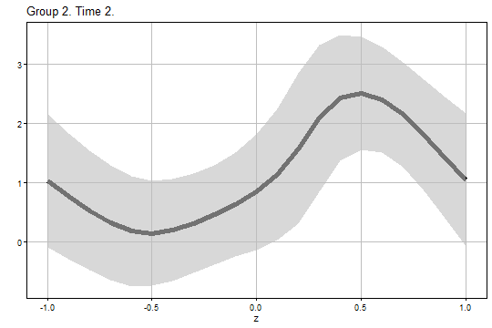
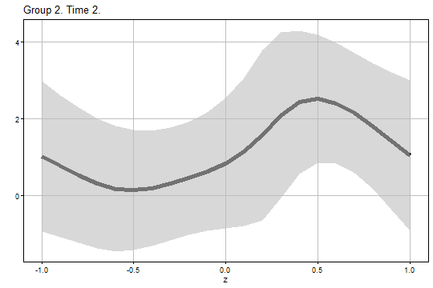
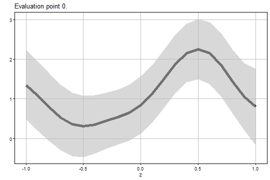

## Introduction

The **didhetero** package provides tools to construct doubly robust 
uniform confidence bands for the group-time conditional average treatment 
effect (CATT) function given a pre-treatment continuous covariate of interest 
and a variety of useful summary parameters in the staggered 
difference-in-differences (DiD) setup of Callaway and Sant'Anna (2021).

This package is useful for understanding the heterogeneity in treatment effects 
with respect to groups, periods, and covariate values in the staggered DiD setting.

The uniform inference methods are developed by [Imai, Qin, and Yanagi (2025) "Doubly Robust Uniform Confidence Bands for Group-Time Conditional Average Treatment Effects in Difference-in-Differences"](https://doi.org/10.48550/arXiv.2305.02185).

## Installation

Get the package from GitHub:


``` r
# install.packages("devtools") # if needed
devtools::install_github("tkhdyanagi/didhetero", build_vignettes = TRUE)
```

## Package Functions

The **didhetero** package provides the following functions.

- `catt_gt_continuous()`: It computes the doubly robust estimates and uniform confidence bands for the CATT function given a continuous pre-treatment covariate of interest.

- `aggte_continuous()`: It computes the doubly robust estimates and uniform confidence bands for the summary parameters that aggregate CATTs.

## The `catt_gt_continuous()` Function

#### Arguments 

The `catt_gt_continuous()` function has the following arguments.

- `yname`: The name of the outcome.
- `tname`: The name of the time periods.
- `idname`: The name of the cross-sectional IDs.
- `gname`: The name of the groups.
   "G = 0" indicates the never treated group.
- `zname`: The name of the scalar continuous covariate
   for which the group-time conditional average treatment effects are estimated
- `xformla`: A formula for the covariates to include in the model.
   It should be of the form `~ X1 + X2`.
   `xformla` should include `zname` as a covariate.
- `data`: The name of data.frame that contains the balanced panel data.
- `zeval`: The vector of the evaluation points z.
- `gteval`: The vector or matrix of the evaluation points g and t.
   If it is a vector, the first and second elements indicate g and t, respectively.
   If it is a matrix, the first and second columns indicate g's and t's, respectively.
   Default is `NULL` and gteval is constructed automatically.
- `pretrend`: Boolean for whether or not to perform the uniform inference 
   for CATT in the pre-treatment periods (i.e., pre-trends in our framework).
   This parameter is only applicable if gteval is `NULL`.
   Default is `FALSE`.
- `control_group`: Which units to use the control group.
   Options are "nevertreated" and "notyettreated".
   Default is "notyettreated".
- `anticipation`: The number of time periods before participating in the
   treatment where units can anticipate participating in the treatment and
   therefore it can affect their untreated potential outcomes.
   Default is 0.
- `alp`: The significance level. Default is 0.05.
- `bstrap`: Boolean for whether or not to perform weighted bootstrapping.
   Default is `TRUE`.
   If bstrap is `FALSE`, only the analytical critical value is used.
- `biters`: The number of bootstrap iterations.
   This parameter is only applicable if `bstrap = TRUE`.
   Default is 1000. 
- `porder`: The polynomial order used for the second- and third-stage estimation.
   Options are 1 and 2,
   which correspond to the local linear and quadratic regressions, respectively.
   Default is 2.
- `kernel`: The kernel function used for the local polynomial regressions.
   Options are "gau" for the Gaussian kernel and
   "epa" for the Epanechnikov kernel.
   Default is "gau".
- `bwselect`: The bandwidth selection method used for the second- and third-stage estimation.
   Options are "IMSE1", "IMSE2", "US1", and "manual".
   "IMSE1" and "IMSE2" mean the IMSE-optimal bandwidths for the local linear and quadratic regressions, respectively.
   "US1" means the rule-of-thumb undersmoothing bandwidth for the local linear regression.
   "manual" means the manual selection and bw should be specified in this case.
   Default is "IMSE1", which is recommended for use with `porder = 2`.
- `bw`: The bandwidth used for the second- and third-stage estimation.
   Default is `NULL` and the bandwidth is chosen automatically.
   This parameter is only applicable if bwselect is "manual", and 
   should be a scalar or a vector whose length equals to the number of rows of gteval.
- `uniformall`: Boolean for whether or not to perform the uniform inference over (g, t, z).
   Default is `TRUE`, and the uniform inference over (g, t, z) is performed.
   If `FALSE`, the uniform inference only over z is performed.

#### Returns

The `catt_gt_continuous()` function returns a list that contains the following elements.

- `Estimate`: A data.frame that contains the following elements.
  - `g`: The group.
  - `t`: The period.
  - `z`: The covariate value.
  - `est`: The doubly robust estimate for CATT.
  - `se`: The standard error.
  - `ci1_lower`: The lower bound of the analytical uniform confidence band.
  - `ci1_upper`: The upper bound of the analytical uniform confidence band.
  - `ci2_lower`: The lower bound of the bootstrap uniform confidence band.
  - `ci2_upper`: The upper bound of the bootstrap uniform confidence band.
  - `bw`: The bandwidth.
- `Figure1`: A list that contains the ggplot elements for the analytical uniform confidence bands.
- `Figure2`: A list that contains the ggplot elements for the bootstrap uniform confidence bands.

## The `aggte_continuous()` function

#### Arguments

The `aggte_continuous()` function has the following arguments.

- `output`: The output of the `catt_gt_continuous` function. 
   In doing so, several arguments and the uniform inference results for CATT from 
   the `catt_gt_continuous` function can be used in this function.
   In particular, the following are passed down from output: 
   `xformla`, `zeval`, `pretrend`, `control_group`, `anticipation`, `alp`, and `kernel`.
- `type` Which type of the summary parameter is of interest.
   Options are "simple", "dynamic", "group", and "calendar".
   Default is "dynamic".
- `eval`: The vector of the evaluation point specific to the chosen summary parameter.
   If type is set to "dynamic", it is the evaluation point e.
   If type is set to "group", it is the evaluation point g'.
   If type is set to "calendar", it is the evaluation point t'.
   If type is set to "simple", there is no evaluation point specific to this summary parameter, and eval should be `NULL`.
   Default is `NULL` and eval is constructed automatically.
- `bstrap`: Boolean for whether or not to perform multiplier bootstrapping.
   Default is `TRUE`.
   If bstrap is `FALSE`, only the analytical critical value is used.
- `biters`: The number of bootstrap iterations.
   This parameter is only applicable if bstrap is `TRUE`.
   Default is 1000.
- `porder`: The polynomial order used for the second- and third-stage estimation.
   Options are 1 and 2,
   which correspond to the local linear and quadratic regressions, respectively.
   Default is 2.
- `bwselect`: The bandwidth selection method used for the aggregation.
   Options are "IMSE1", "IMSE2", "US1", and "manual".
   "IMSE1" and "IMSE2" mean the IMSE-optimal bandwidths for the local linear and quadratic regressions, respectively.
   "US1" means the rule-of-thumb undersmoothing for the local linear regression.
   "manual" means the manual selection and bw should be specified in this case.
   Default is "IMSE1", which is recommended for use with `porder = 2`.
- `bw`:
   The bandwidth used for the aggregation.
   Default is `NULL` and the bandwidth is chosen automatically.
   This parameter is only applicable if bwselect is "manual", and 
   should be a scalar or a vector whose length equals to the number of rows of eval.
- `uniformall`: Boolean for whether or not to perform the uniform inference over both eval and z.
   Default is `TRUE` and the uniform inference over eval and z is performed.
   If `FALSE`, the uniform inference only over z is performed.

#### Returns

The `aggte_continuous()` function returns a list that contains the following elements.

- `Estimate`: A data.frame that contains the following elements.
  - `eval`: The evaluation point specific to the chosen summary parameter.
  - `z`: The covariate value.
  - `est`: The doubly robust estimate of the chosen summary parameter.
  - `se`: The standard error.
  - `ci1_lower`: The lower bound of the analytical uniform confidence band.
  - `ci1_upper`: The upper bound of the analytical uniform confidence band.
  - `ci2_lower`: The lower bound of the bootstrap uniform confidence band.
  - `ci2_upper`: The upper bound of the bootstrap uniform confidence band.
  - bw: The bandwidth.
- `Figure1`: A list that contains the ggplot elements for the analytical uniform confidence bands.
- `Figure2`: A list that contains the ggplot elements for the bootstrap uniform confidence bands.

## Examples

We begin by generating artificial data using the `datageneration()` function.


``` r
# Load the package
library(didhetero)

# Generate artificial data
set.seed(1)
data <- datageneration(n = 500, tau = 4)
```

We can see the variables' names in the dataset with:


``` r
head(data)
#>   id period           Y G          Z
#> 1  1      1  0.98412124 2 -0.6264538
#> 2  1      2  1.77999550 2 -0.6264538
#> 3  1      3 -0.02004389 2 -0.6264538
#> 4  1      4  6.43951734 2 -0.6264538
#> 5  2      1  3.37331543 2  0.1836433
#> 6  2      2  5.59684221 2  0.1836433
```

We can run the `catt_gt_continuous()` function to compute the doubly robust estimates and uniform confidence bands for the CATT function given the continuous covariate $Z$:


``` r
output1 <- catt_gt_continuous(
  yname = "Y",
  tname = "period",
  idname = "id",
  gname = "G",
  zname = "Z",
  xformla = ~ Z,
  data = data,
  zeval = seq(-1, 1, by = 0.1),
  gteval = NULL,
  pretrend = FALSE,
  control_group = "notyettreated",
  anticipation = 0,
  alp = 0.05,
  bstrap = TRUE,
  biters = 1000,
  porder = 2,
  kernel = "gau",
  bwselect = "IMSE1",
  bw = NULL,
  uniformall = TRUE
)
```

The estimation and uniform inference results are:

``` r
head(output1$Estimate)
#>   g t    z       est        se   ci1_lower ci1_upper  ci2_lower ci2_upper        bw
#> 1 2 2 -1.0 1.0264796 0.4222882 -0.09707295  2.150032 -0.9308918  2.983851 0.2547594
#> 2 2 2 -0.9 0.7652004 0.3980792 -0.29394090  1.824342 -1.0799584  2.610359 0.2547594
#> 3 2 2 -0.8 0.5273424 0.3785987 -0.47996845  1.534653 -1.2275212  2.282206 0.2547594
#> 4 2 2 -0.7 0.3192217 0.3636817 -0.64840072  1.286844 -1.3664996  2.004943 0.2547594
#> 5 2 2 -0.6 0.1813663 0.3498634 -0.74949043  1.112223 -1.4403045  1.803037 0.2547594
#> 6 2 2 -0.5 0.1441067 0.3353516 -0.74813968  1.036353 -1.4102999  1.698513 0.2547594
```

The figure of the analytical uniform confidence band for $g = 2$ and $t = 2$ is:

``` r
output1$Figure1$g2_t2
```



The figure of the bootstrap uniform confidence band for $g = 2$ and $t = 2$ is:

``` r
output1$Figure2$g2_t2
```



We can run the `aggte_continuous()` function to compute the doubly robust estimates and uniform confidence bands for the event-study-type parameter given the continuous covariate $Z$:


``` r
output2 <- aggte_continuous(
  output = output1,
  type = "dynamic",
  eval = NULL,
  bstrap = TRUE,
  biters = 1000,
  porder = 2,
  bwselect = "IMSE1",
  bw = NULL,
  uniformall = TRUE
)
```

The estimation and uniform inference results are:

``` r
head(output2$Estimate)
#>   eval    z       est        se  ci1_lower ci1_upper   ci2_lower ci2_upper        bw
#> 1    0 -1.0 1.3522719 0.2938703  0.5590099  2.145534  0.47091346  2.233630 0.2296415
#> 2    0 -0.9 1.0763768 0.2923213  0.2872961  1.865457  0.19966408  1.953089 0.2296415
#> 3    0 -0.8 0.7894387 0.2849603  0.0202280  1.558649 -0.06519735  1.644075 0.2296415
#> 4    0 -0.7 0.5326729 0.2758289 -0.2118887  1.277235 -0.29457664  1.359922 0.2296415
#> 5    0 -0.6 0.3607236 0.2673598 -0.3609771  1.082424 -0.44112621  1.162573 0.2296415
#> 6    0 -0.5 0.3072095 0.2575102 -0.3879036  1.002323 -0.46510000  1.079519 0.2296415
```

The figure of the analytical uniform confidence band for $e = 0$ is:

``` r
output2$Figure1$eval0
```


The figure of the bootstrap Uuniform confidence band for $e = 0$ is:

``` r
output2$Figure2$eval0
```



## References

- Callaway, B., & Sant’Anna, P. H. (2021). 
Difference-in-differences with multiple time periods. 
Journal of Econometrics, 225(2), 200-230.
[Link](https://doi.org/10.1016/j.jeconom.2020.12.001)

- Imai, S., Qin, L., & Yanagi, T. (2025). 
Doubly Robust Uniform Confidence Bands for Group-Time Conditional Average Treatment Effects in Difference-in-Differences.
arXiv preprint arXiv:2305.02185.
[Link](https://doi.org/10.48550/arXiv.2305.02185)
